# Chikitsa System Architecture

The following diagram represents the actual system architecture of the Chikitsa React web application based on the project source code.

```mermaid
graph TD
    %% Custom Styles
    classDef userLayer fill:#1e293b,stroke:#475569,stroke-width:2px,color:#f8fafc,rx:10px,ry:10px;
    classDef fwLayer fill:#0f172a,stroke:#3b82f6,stroke-width:2px,color:#bfdbfe,rx:10px,ry:10px;
    classDef pLayer fill:#064e3b,stroke:#22c55e,stroke-width:2px,color:#bbf7d0,rx:5px,ry:5px;
    classDef contextLayer fill:#4c1d95,stroke:#a855f7,stroke-width:2px,color:#e9d5ff,rx:5px,ry:5px;
    classDef serviceLayer fill:#9f1239,stroke:#fb7185,stroke-width:2px,color:#ffe4e6,rx:5px,ry:5px;
    classDef extLayer fill:#451a03,stroke:#eab308,stroke-width:2px,color:#fef08a,rx:5px,ry:5px;
    classDef transparent fill:none,stroke:none;

    %% Client Layer
    Users(👥 Users / Clients):::userLayer

    %% Framework Layer
    subgraph Core[Core Tech Stack]
        React[React + Vite + TypeScript]:::fwLayer
        Tailwind[Tailwind CSS]:::fwLayer
        Router[React Router DOM]:::fwLayer
    end

    %% Presentation Layer
    subgraph Presentation[Presentation Layer / UI]
        direction TB
        Layouts[App Layout]:::pLayer
        
        subgraph Pages[Application Pages]
            P1[Landing & Auth]:::pLayer
            P2[Dashboard]:::pLayer
            P3[Meals & Grocery]:::pLayer
            P4[Map & Community]:::pLayer
            P5[Chat & Logs]:::pLayer
            P6[Profile & Achievements]:::pLayer
        end
        
        subgraph Components[UI Components]
            C1[HeroScroll]:::pLayer
            C2[VirtualPet]:::pLayer
            C3[Recharts Graphs]:::pLayer
            C4[Framer Motion Animations]:::pLayer
        end

        Layouts --> Pages
        Pages --> Components
    end
    class Presentation transparent

    %% State Management Layer
    subgraph State[State Management Layer / Contexts]
        direction LR
        S1[AuthContext<br/>User Authentication State]:::contextLayer
        S2[GamificationContext<br/>Points, Streaks & Levels]:::contextLayer
        S3[ThemeContext<br/>Light/Dark Mode]:::contextLayer
    end
    class State transparent

    %% Application / Service Logic Layer
    subgraph Services[Application Services Layer]
        direction LR
        L1[firebase.ts<br/>Firebase App Init]:::serviceLayer
        L2[firestore.ts<br/>Database CRUD & Queries]:::serviceLayer
        L3[gemini.ts<br/>AI Model Integration]:::serviceLayer
        L4[validation.ts<br/>Form & Data Validation]:::serviceLayer
    end
    class Services transparent

    %% External Infrastructure
    subgraph External[External Services & Infrastructure]
        direction LR
        E1[🔥 Firebase Authentication]:::extLayer
        E2[🔥 Cloud Firestore]:::extLayer
        E3[✨ Google Gemini API]:::extLayer
        E4[📍 Leaflet / OpenStreetMap]:::extLayer
    end
    class External transparent

    %% Data Flow
    Users --> React
    Core --> Presentation
    Pages --> State
    State --> S1 & S2 & S3
    
    %% Service Connections
    S1 --> L1
    S1 --> L2
    S2 --> L2
    Pages --> L3
    Pages -.-> L2
    Pages -.-> L4

    %% API Integrations
    L1 --> E1
    L2 --> E2
    L3 --> E3
    Pages --> E4
```

## Description of Layers

1.  **Core Tech Stack:** The foundation of the app is built on **React 19** with **Vite** as the build tool, configured with **TypeScript** for type safety, **React Router DOM** for navigation, and **Tailwind CSS** for styling.
2.  **Presentation Layer:** Contains all the UI elements including layouts, individual feature pages (Meals, Grocery, Dashboard, Maps, Community, etc.), and shared components (like Recharts visualizations or the VirtualPet).
3.  **State Management Layer:** Utilizes React's Context API to manage global state such as the user's authentication data (`AuthContext`), their rewards/exp system (`GamificationContext`), and basic UI preferences (`ThemeContext`).
4.  **Application Services Layer:** Dedicated modules for handling specific business logic and API integrations cleanly separated from UI components (`firestore.ts` for database interactions, `gemini.ts` for AI operations).
5.  **External Services:** Third-party BaaS platforms and APIs providing backend functionality (Authentication, Database, Geo-mapping, and LLM processing).
